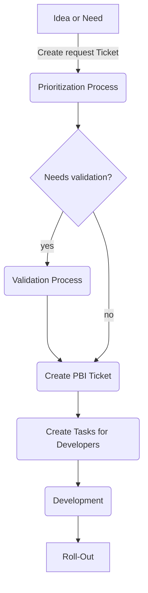

# Developer Guidelines
The Guidelines are defined to onboard developers to the Main development process and structure incoming requests from other departments.
They are publicly available because they are anonymous and team members should be able to easily access them.
## Table of Contents
[Basic Workflow (graph)](#basic-workflow) 
[Process details](#process-details) 
[Idea or Need (R-Ticket)](#idea-or-need) 
[Submitting an R-Ticket](#submitting-an-r-ticket) 
[Read more](#read-more) 

## Basic Workflow
Details to on each step are described below the graph.

## Process Details
The process details give you an insight on the steps defined in the graph. 
The workflow described is used for new feature requests. 
Bugreports and Error handling is described [here](ErrorHandling.md).

### Idea or Need
Any person or department that has come up with an idea or has identified a need, must input a R-Ticket (request ticket). 
The R-Ticket is submitted to the backlog and discussed with the submitter by the product manager in charge.

#### Submitting an R-Ticket
R-Tickets are submitted using a ticket form. The <strong>link to the form</strong> is protected by individual user credentials.
To receive access, <strong>contact the product management</strong>. Input at least the mandatory fields and send the request.

Prioritizing tickets at this point isn't possible. The priority is calculated by the system based on the input. 
This ensures fairness across all departments and users.

Ticket input is handled by the FiFo (First in, First out) principle. The first ticket in, is the first ticket out. Anyway, this principle doesn't apply 
to the later process of Prioritizing.

### Prioritizing tickets
In the prioritization process, tickets are reviewed by the product management and deciders. 
Prioritization is done using the Eisenhower Matrix. 

The x-axis represents the urgency and the y-axis the importance.

|                                | urgent | not urgent |
|--------------------------------|--------|------------|
| <strong>important</strong>     | 1      | 2          |
| <strong>not important</strong> | 3      | 4          |

R-Tickets are challenged by matching KPIs (key performance indicators).
Depending on the outcome, the ticket is placed in of the four quadrants:

1. Do (as soon as possible)
2. Plan in Roadmap
3. Delegate if possible or plan right after 1
4. Discard or move to long term back log

If an R-Ticket is rated one (1), it receives an additional priority, depending on the effect on the system.
R-Tickets never have a higher priority than critical errors but may have a higher priority than minor bugs.

# Read more
[Bug report and error handling](ErrorHandling.md) 
[TdDos for process owners](ToDo.md)
  