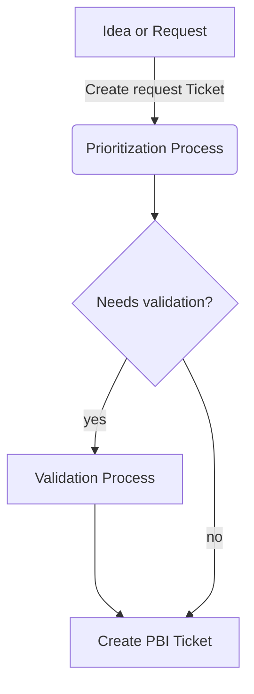

# Developer Guidelines
The Guidelines are defined to onboard developers to the Main development process.
## Basic Workflow

```mermaid
graph TD
    A[Idea or Request] -->|Create request Ticket| B(Prioritization Process)
    B --> C{Needs validation?}
    C -->|yes| D[Validation Process] ---> E
    C -->|no| E[Create PBI Ticket]
 
```

  