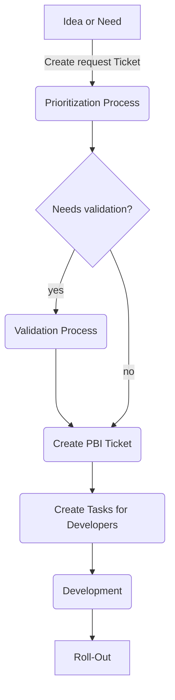

# Developer Guidelines
The Guidelines are defined to onboard developers to the Main development process and structure incoming requests from other departments.
## Table of Contents
[Basic Workflow (graph)](#basic-workflow) 
[Process details](#process-details) 
[Idea or Need](#idea-or-need) 
[Read more](#read-more) 

## Basic Workflow
Details to on each step are described below the graph.

## Process Details
The process details give you an insight on the steps defined in the graph. 
The workflow described is used for new feature requests. 
Bugreports and Error handling is described [here](ErrorHandling.md).

### Idea or Need

# Read more
[Bug report and error handling](ErrorHandling.md)
  