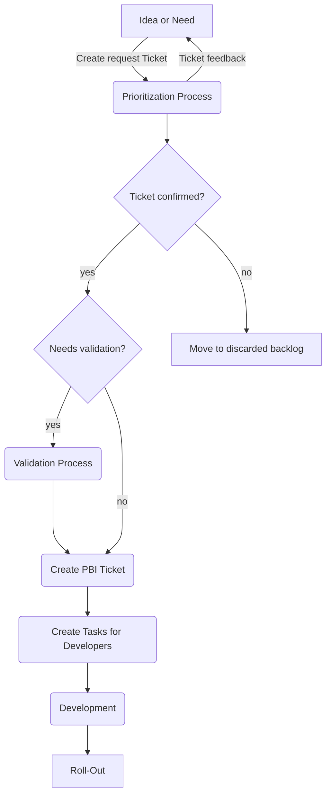

# Developer Guidelines
The Guidelines are defined to onboard developers to the Main development process and structure incoming requests from other departments.
They are publicly available because they are anonymous and team members should be able to easily access them.
## Table of Contents
1. [Basic Workflow (graph)](#basic-workflow)
2. [Process details](#process-details)
3. [Idea or Need (R-Ticket)](#idea-or-need) 
[Submitting an R-Ticket](#submitting-an-r-ticket)
4. [Prioritization](#prioritizing-tickets) 
[Estimation](#estimating-tickets)
5. [Validation](#validating-tickets) 
   [Test Driven](#test-driven) 
   [Data Driven](#data-driven) 
   [Prototype definition](#prototype-definition) 
8. [Read more](#read-more)

## Basic Workflow
Details to on each step are described below the graph.

## Process Details
The process details give you an insight on the steps defined in the graph. 
The workflow described is used for new feature requests. 
Bugreports and Error handling is described [here](ErrorHandling.md).

### Idea or Need
Any person or department that has come up with an idea or has identified a need, must input a R-Ticket (request ticket). 
The R-Ticket is submitted to the backlog and discussed with the submitter by the product manager in charge.

#### Submitting an R-Ticket
R-Tickets are submitted using a ticket form. The <strong>link to the form</strong> is protected by individual user credentials.
To receive access, <strong>contact the product management</strong>. Input at least the mandatory fields and send the request.

Prioritizing tickets at this point isn't possible. The priority is calculated by the system based on the input. 
This ensures fairness across all departments and users.

Ticket input is handled by the FiFo (First in, First out) principle. The first ticket in, is the first ticket out. The principle doesn't apply 
to the later process of Prioritizing.

R-Tickets are marked in the Board with an [R] prefix.

### Prioritizing tickets
In the prioritization process, tickets are reviewed by the product management and deciders. 
Prioritization is done using the Eisenhower Matrix. 

The x-axis represents the urgency and the y-axis the importance.

|                                | urgent | not urgent |
|--------------------------------|--------|------------|
| <strong>important</strong>     | 1      | 2          |
| <strong>not important</strong> | 3      | 4          |

R-Tickets are challenged by matching KPIs (key performance indicators).
Depending on the outcome, the ticket is placed in of the four quadrants:

1. Do (as soon as possible)
2. Plan in Roadmap
3. Delegate if possible or plan right after 1
4. Discard or move to long term back log

R-Tickets rated one (1), receive an additional priority depending on:
* Consumption of resources,
* Available resources,
* prerequisites.

<strong>KPIs</strong> used to prioritize are:
* estimated costs,
* available resources,
* bound resources,
* technical risks,
* dependencies (third party, input, legal requirements),
* expected economical outcome short term (+3 Months),
* expected economical outcome long term* (+2 Years),
* effect on the overall goal, focus on the mission.

R-Tickets never have a higher priority than critical errors but may have a higher priority than minor bugs.

#### Estimating tickets
The estimation is a crucial part of prioritizing. It is used to allocate:
1. the cost-benefit ratio,
2. bound resources,
3. duration,
4. total costs.

The R-Ticket owner will be contacted by the product management with the estimate and must approve or decline the Ticket.
Declined tickets are saved to a declined backlog. The final reason of declination should be written in a comment for future 
review. Once the ticket is approved by the creator, it will either be lined up for validation or transferred into a PBI-Ticket.

This sub-process makes the ticket credible and accountable to it's origin.

### Validating Tickets
Validation of tickets follow two methodologies:
1. Test Driven (TD)
2. Data Driven (DD)

Both can be applied if useful.

#### Test Driven
Defined tests are run on either a prototype or any type of concept, involving later stakeholders. Keep in mind, that stakeholders may also be the consumer or user.

#### Data Driven
Proof of concept is given by KPIs defined and measured via prototypes or other technical approaches. 
Usually, this type of validation involves a broader audience than the test driven approach and therefore is to be preferred if possible.

The downside is, it more likely comes with higher initial costs.

#### Prototype definition
The Prototype is any type of approach to enable receiving the KPIs needed to validate the goal of a feature. Prototyping can be done in two ways:
1. Rapid Prototyping
2. Incremental Prototyping

The rapid prototype only serves the need to measure the KPIs with least effort and costs. The incremental prototype considers reusing components or the 
complete prototype for the later development of the feature.

# Read more
[Bug report and error handling](ErrorHandling.md) 
[TdDos for process owners](ToDo.md)
  