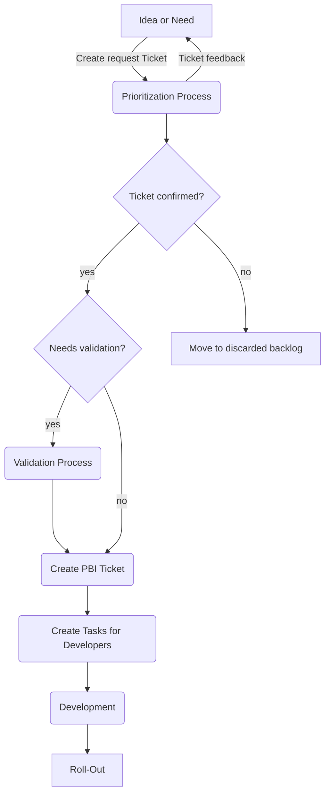

# Request Workflow Definition
The Guidelines are defined to onboard developers to the Main development process and structure incoming requests from other departments.
They are publicly available because they are anonymous and team members should be able to easily access them.
## Table of Contents
1. [Basic Workflow (graph)](#basic-workflow)
2. [Process details](#process-details)
3. [Idea or Need (R-Ticket)](#idea-or-need) 
[Submit a R-Ticket](#submit-a-r-ticket)
4. [Prioritization](#prioritize-tickets) 
[Estimation](#estimate-tickets)
5. [Validation](#validate-tickets) 
   [Test Driven](#test-driven) 
   [Data Driven](#data-driven) 
   [Prototype definition](#prototype-definition) 
   [Benefits](#benefits-of-validating) 
6. [Create PBI Tickets](#create-pbi-tickets)
7. [Create tasks for Developers](#create-tasks-for-developers)
8. [Development](#development) 
[Versioning](#versioning) 
[Branching](#branching)
9. [Read more](#read-more)

## Basic Workflow
Details to on each step are described below the graph.

## Process Details
The process details give you an insight on the steps defined in the graph. 
The workflow described is used for new feature requests. 
Bugreports and Error handling is described [here](ErrorHandling.md).

### Idea or Need
Any person or department wanting to submit an idea or a need, must input an R-Ticket (request ticket). 
The R-Ticket is submitted to the inbox backlog and discussed between the creator and the product manager.

#### Submit a R-Ticket
R-Tickets are submitted using a ticket form. The <strong>link to the form</strong> is protected by individual user credentials.
To receive access, <strong>contact the product management</strong>. Input at least the mandatory fields and send the request.

Prioritizing tickets at this point isn't possible. The priority is calculated by the system based on the input. 
This ensures fairness across all departments and users.

Ticket input is handled by the FiFo (First in, First out) principle. The first ticket in, is the first ticket out. The principle doesn't apply 
to the later process of Prioritizing.

R-Tickets are marked in the Board with an [R] prefix.

### Prioritize tickets
In the prioritization process, tickets are reviewed by the product management and deciders. 
Prioritization is done using the Eisenhower Matrix. 

The x-axis represents the urgency and the y-axis the importance.

|                                | urgent | not urgent |
|--------------------------------|--------|------------|
| <strong>important</strong>     | 1      | 2          |
| <strong>not important</strong> | 3      | 4          |

R-Tickets are challenged by matching KPIs (key performance indicators).
Depending on the outcome, the ticket is placed in of the four quadrants:

1. Do (as soon as possible)
2. Plan in Roadmap
3. Delegate if possible or plan right after 1
4. Discard or move to long term back log

R-Tickets rated one (1), receive an additional priority depending on:
* Consumption of resources,
* Available resources,
* prerequisites.

<strong>KPIs</strong> used to prioritize are:
* estimated costs,
* available resources,
* bound resources,
* technical risks,
* dependencies (third party, input, legal requirements),
* expected economical outcome short term (+3 Months),
* expected economical outcome long term* (+2 Years),
* effect on the overall goal, focus on the mission.

R-Tickets never have a higher priority than critical errors but may have a higher priority than minor bugs.

#### Estimate tickets
The estimation is a crucial part of prioritizing. It is used to allocate:
1. the cost-benefit ratio,
2. bound resources,
3. duration,
4. total costs.

The R-Ticket owner will be contacted by the product management with the estimate and must approve or decline the Ticket.
Declined tickets are saved to a declined backlog. The final reason of declination should be written in a comment for future 
review. Once the ticket is approved by the creator, it will either be lined up for validation or transferred into a PBI-Ticket.

This sub-process makes the ticket credible and accountable to it's origin.

### Validate Tickets
Validation of tickets follow two methodologies:
1. Test Driven (TD)
2. Data Driven (DD)

Both can be applied if useful.

#### Test Driven
Defined tests are run on either a prototype or any type of concept, involving later stakeholders. Keep in mind, that stakeholders may also be the consumer or user.

#### Data Driven
Proof of concept is given by KPIs defined and measured via prototypes or other technical approaches. 
Usually, this type of validation involves a broader audience than the test driven approach and therefore is to be preferred if possible.

The downside is, it more likely comes with higher initial costs.

#### Prototype definition
The Prototype is any type of approach to enable receiving the KPIs needed to validate the goal of a feature. Prototyping can be done in two ways:
1. Rapid Prototyping
2. Incremental Prototyping

The rapid prototype only serves the need to measure the KPIs with least effort and costs. The incremental prototype considers reusing components or the 
complete prototype for the later development of the feature.

The effort of prototyping ideally is kept at a minimum.

### Benefits of validating
Depending on organizational decisions, R-Ticket creators (or their departments) are held credible or accountable. Although validation is no guarantee for success, it minimizes the risks and is therefore recommended.

## Create PBI Tickets
A PBI-Ticket (Product Backlog Item) is essential for developers to implement a feature. It differs from the R-Ticket by including more technical details and the results from prioritizing.
Depending on the organizational structure, the Ticket must include meta information that are appended as fields.
PBI Tickets are created by lead developers or project managers. The ticket contains sub tickets that are assigned to specific team members of the development and/or test team. 
It's a two layered ticket with general information saved in the main PBI Ticket and specific information or notes of the team members in the assigned sub tickets. 

Typically, a PBI Ticket has at least two sub tickets, one for the developer and one for the tester. Both interact via the main ticket. The main ticket is the single source of truth.

The PBI Ticket is created using the KanBan Board set up for the specific project.

## Create Tasks for developers
As described in the section Creating PBI Tickets, each PBI Ticket has sub tickets. These sub tickets are also referred to as Tasks. In this specific Process, sub tickets are assigned to developers, after discussing details about the PBI with the team.
The developer (or tester) only works with this ticket. The main ticket is not moved within the board without the developer and tester agreeing and the lead developer confirming the next step on the board.

## Development
Developers working on ongoing PBI Tickets with assigned tasks, are blocked for other PBIs, unless their task is finished or waiting for any dependency. 
If the task of a developer is fully closed, other PBIs can be assigned. If the developer has parked the ticket, because of missing prerequisites or missing input, assignments must be discussed with the team lead.

It's mandatory for the developer to write unit tests and documentation while developing a feature. The documentation must be linked in the PBI Ticket.

### Versioning
The versioning follows this pattern:

[Major-Version].[Minor-Version].[Hotfix-Version]

#### Major Version
Defined by the product management and related to a Milestone.

#### Minor Version
Defined by the product team and related to sprints.

#### Hotfix Version
Automatically managed by the repository and assigned after a merge to the master branch.

### Branching
Branches are named by the Ticket number of the PBI. If it's a hotfix, it should be prefixed with [HF].
If the ticket origins from a R-Ticket, it is prefixed [R].

# Read more
[Bug report and error handling](ErrorHandling.md) 
[TdDos for process owners](ToDo.md)
  